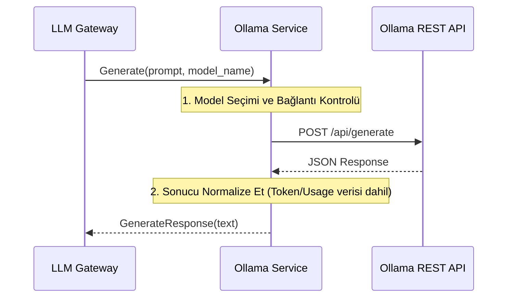

# 🦙 Sentiric LLM Ollama Service - Mantık ve Akış Mimarisi

**Stratejik Rol:** Ollama veya yerel olarak barındırılan diğer LLM motorlarıyla entegrasyon için esnek bir adaptör sağlar. Bu, Sentiric'in bulut dışı (on-premise) LLM yeteneklerini destekler.

---

## 1. Temel Akış: Yerel Metin Üretme (Generate)

## 2. Esneklik
* Model Adı: Doğrudan Ollama'nın desteklediği model adlarını (llama2, phi3, mistral) kullanır.
* Ağ Katmanı: Ollama, HTTP tabanlı bir API sunduğu için, bu servis httpx kullanarak asenkron HTTP çağrıları yapacaktır.